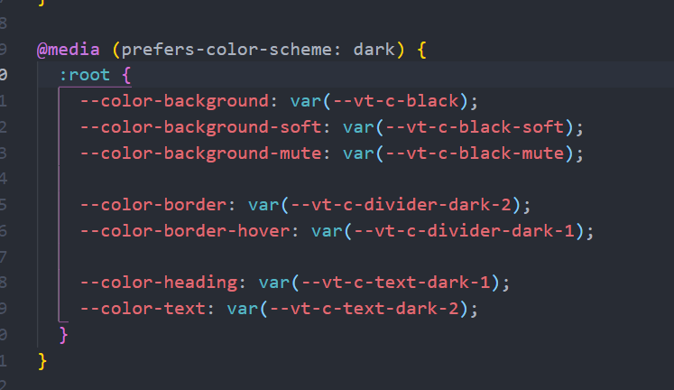

## 写接口express, ts

```js
npm install ts-node -g
npm init -y
npm install @types/node -D  // 安装node的声明文件
npm install express -S
npm install @types/express -D
npm install axios -S
```


#### 运行数据接口在3333端口

```js
cd node-api
node run dev
```


## 建前端项目

```js
npm init vue@latest
Project-Name: visual
ts: Yes
JSX: Yes
Vue Router: No
Pinia: Yes
Vitest: No
Cypress: No
Eslint: No

cd visual
cnpm install
npm run dev

cnpm install axios -S
```


## 新建的项目可以根据电脑主体深浅自动改变颜色主体

在assets/base.css下    prefers-color-scheme属性：light, dark, 




## 项目编译

编译后没有assets目录, 图片应该在script里引入


## 简单的跨域配置

不安全

```js
app.use("*", (req, res, next) => {
    res.header('Access-Control-Allow-Origin', "*");
    next()
})
```


## 安装echarts

```
cnpm install echarts -S
```


## Json2TS插件

将json数据转成ts类型